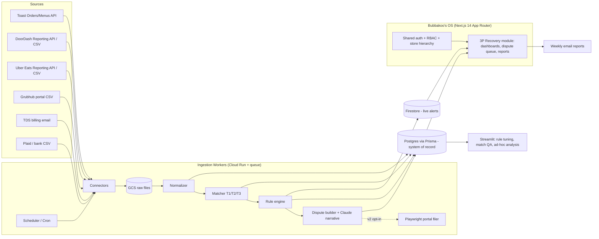

# Loop (tryloop.ai) Teardown + Bubbakoo's In-House Rebuild Plan

**Prepared for:** JC, Field Business Consultant / internal software, Bubbakoo's Burritos
**Date:** 2026-09-27
**Status:** Research + architecture draft. Items marked **[ASSUMPTION]** need checking. Items marked **[UNVERIFIED]** could not be confirmed from public sources.

> **Research limits.** The research sandbox blocked direct fetches of tryloop.ai, loopai.com, doc.toasttab.com, developer.uber.com and help.doordash.com. Facts about those sites come from search-engine snippets of those pages plus third-party coverage. Confirm anything contract-critical, like API terms and rate limits, on the primary page before building.

---

## Executive Summary

- **Loop is who we think it is, but it has grown.** tryloop.ai is now **Loop AI** (loopai.com). It started as a third-party delivery reconciliation and chargeback tool and now pitches "agentic AI co-workers" for restaurant and retail back offices. It has raised $20M ($6M seed + $14M Series A, Feb 2026), serves 300+ brands and 4,000+ locations, and does not publish its pricing.
- **Most of the value is plumbing, not AI:** (1) pull data from Toast, DoorDash, Uber Eats, Grubhub and the bank, (2) match every order three ways (Toast ↔ platform ↔ payout), (3) flag error charges and underpayments, (4) file disputes before the 14–30 day windows close. We can build every part of this.
- **Dispute filing is the hard part.** None of DoorDash, Uber Eats or Grubhub has a public dispute API. Disputes go through merchant portals, so vendors either have partner-level access or run automated browser logins. This is the biggest ToS and fragility risk, so our MVP should detect the error and pre-fill the dispute, with a person clicking submit. Unattended filing waits until v2.
- **Build vs. buy depends on Loop's price, which isn't public.** Building breaks even at about **21 stores** if Loop charges $200/store/month and about **65 stores** at $100/store/month. If Loop charges 20% of what it recovers, buying wins until about **183 stores**. These figures assume we recover 85% of what Loop would. Get a real Loop quote and run a cheap MVP to measure our actual recoverable dollars before committing (see §3.3).
- **Where it lives:** a module inside Bubbakoo's OS (shared auth, store hierarchy and roles) with a separate ingestion worker service and **Postgres via Prisma as the system of record**. Firestore is only for the live alert feed; Streamlit is for internal rule-tuning and analysis. MVP takes about 6–8 weeks part-time; full v2 about 600–750 solo developer hours.

---

## 1. Research: Loop

### 1.1 Identity check (ambiguity flagged)

| Item | Finding |
|---|---|
| Correct company | **Loop AI**, formerly "Loop – Delivery Intelligence Platform", domain tryloop.ai, now loopai.com. San Francisco, founded 2022 by ex-Uber/Google engineers. ([TechStory](https://techstory.in/loop-ai-raises-14-mn-to-untangle-restaurants-delivery-complexity/), [LinkedIn](https://www.linkedin.com/company/tryloopai)) |
| Name collisions | **Loop Returns** and **Loop Subscriptions** (Shopify e-commerce apps) are unrelated but show up in G2 and pricing searches ([G2](https://www.g2.com/products/loop-returns/reviews)). Don't mix them up in vendor research. |
| Positioning drift | The homepage now reads "AI co-workers for the real economy", covering restaurant **and retail** back offices ([loopai.com](https://www.loopai.com/), [AI Insider](https://theaiinsider.tech/2026/02/05/loop-ai-closes-14m-series-a-to-expand-agentic-ai-platform-for-restaurant-and-retail-operations/)). Delivery is still the core product. |
| Funding | $6M seed (2024) ([Restaurant Business](https://www.restaurantbusinessonline.com/technology/loopai-raises-6m-app-automates-third-party-delivery-bookkeeping)). $14M Series A on 2026-02-02, led by Nyca Partners with Base10, Afore and others ([QSR Magazine](https://www.qsrmagazine.com/news/loop-ai-announces-14m-series-a-funding-round/), [Loop blog](https://www.loopai.com/blog/loop-ai-raises-14m-series-a)) |
| Scale | 300+ brands, "thousands" / 4,000+ locations. Named customers include Little Caesars, McDonald's, The Halal Guys, Whataburger, Lazy Dog, Starbird, MIXT and Craveworthy Brands ([QSR Web](https://www.qsrweb.com/news/loop-ai-secures-14m-series-a-to-scale-restaurant-back-office-technology/), [HORECA](https://horecamea.com/2026/02/04/loop-ai-secures-us14m-to-make-restaurant-delivery-profitable-with-agentic-co-worker/)). Most of these are franchisees or specific groups, not whole systems **[ASSUMPTION]**. |

### 1.2 What Loop does, end to end

| Module | What it does | Source |
|---|---|---|
| **3P reconciliation** | Matches orders to payouts across DoorDash, Uber Eats, Grubhub, Postmates and Olo. Posts revenue journal entries automatically so staff stop pulling reports. | [Aprio](https://www.aprio.com/aprio-collaborates-with-loop-ai-to-help-restaurants-maximize-third-party-delivery-service-profitability-ins-firmnews/), [Food On Demand](https://foodondemand.com/10052023/loop-aims-to-be-co-pilot-for-profitable-delivery-strategies/) |
| **Chargeback / dispute automation** | Calculates chargebacks and refunds, finds disputable cases (delivery errors, "friendly fraud") and files the disputes. | [Aprio](https://www.aprio.com/aprio-collaborates-with-loop-ai-to-help-restaurants-maximize-third-party-delivery-service-profitability-ins-firmnews/), [TechStory](https://techstory.in/loop-ai-raises-14-mn-to-untangle-restaurants-delivery-complexity/) |
| **Accounting / ERP push** | NetSuite (published SuiteApp) and Restaurant365 partner integration. | [SuiteApp](https://www.suiteapp.com/LoopAI), [R365](https://www.restaurant365.com/partners/loop/) |
| **Ops / "co-pilot"** | Store uptime, ratings and reviews visibility, promo and marketing optimization, menu and profitability analytics. | [TechStory](https://techstory.in/loop-ai-raises-14-mn-to-untangle-restaurants-delivery-complexity/), [Food On Demand](https://foodondemand.com/10052023/loop-aims-to-be-co-pilot-for-profitable-delivery-strategies/) |
| **Agentic workflows (2026)** | Positioned as an AI worker that does the work, not just a dashboard. Claims about 10% growth for Lazy Dog and Starbird. | [QSR Magazine](https://www.qsrmagazine.com/news/loop-ai-announces-14m-series-a-funding-round/) |

**Integrations publicly named:** DoorDash, Uber Eats, Grubhub, Postmates, Olo, NetSuite and Restaurant365. **POS (Toast/Square/etc.): [UNVERIFIED]**. Loop appears to reconcile mainly platform ↔ payout ↔ GL, not POS ↔ platform. That is a gap we can fill (see §1.5).

**Pricing: not public [UNVERIFIED].** G2 has no reviews and no pricing ([G2](https://www.g2.com/products/loop-ai/reviews)). The closest public comparison is Voosh's dispute manager at **$1.75/location/month** with volume discounts and a claimed 4–5x ROI ([WISK podcast](https://www.wisk.ai/podcast/s2e14-how-voosh-is-solving-restaurants-biggest-third-party-challenges-with-priyam-saraswat)). That price looks too low for full reconciliation and may be old or only for disputes. **[ASSUMPTION]** Loop sells enterprise contracts per location, possibly with a share of recoveries. §3.3 models both.

**Target customer:** multi-unit chains and franchise groups with a lot of third-party volume and a finance team (controllers, accounting firms like Aprio).

### 1.3 How it likely works under the hood (inferred)

| Layer | Most likely method | Evidence / reasoning |
|---|---|---|
| Platform data ingestion | **Mixed:** official reporting APIs where the vendor has approval (DoorDash Reporting API, Uber Eats Reporting API Suite), plus **credentialed portal automation** for everything else. | Loop's public materials never explain how it connects. The industry norm is scraping: Otter "historically used web-scraping" and is moving to APIs ([Cuboh comparison](https://www.cuboh.com/cuboh-vs-deliverect-vs-otter-vs-chowly)). Grubhub has no public reporting API. **[ASSUMPTION]** |
| Reconciliation | Matching at order level, joining order ID → payout statement line → bank deposit, then posting journal entries. | "Automatically filing journal entries for revenue" ([Aprio](https://www.aprio.com/aprio-collaborates-with-loop-ai-to-help-restaurants-maximize-third-party-delivery-service-profitability-ins-firmnews/)) |
| Dispute filing | **Portal automation.** No public dispute API exists on DD, UE or GH. All three document disputes as manual portal flows. | DoorDash: Financials → Transactions → Dispute Charge ([DoorDash](https://merchants.doordash.com/en-us/learning-center/doordash-merchant-refund)). Uber: UEM dashboard ([Uber blog](https://www.uber.com/au/en/blog/dispute-an-order-error/)). Grubhub: Financials → Transactions ([GH help](https://get.grubhub.com/help-center/grubhub-restaurant-policies/)) |
| Reporting | Web dashboards, plus accounting pushes to NetSuite and R365. | Integrations above |

### 1.4 ROI claims, complaints, gaps

- **Claimed:** 6x company growth since 2024 and about 10% sales growth at Lazy Dog and Starbird ([QSR Magazine](https://www.qsrmagazine.com/news/loop-ai-announces-14m-series-a-funding-round/)). MIXT has a case study ([Loop](https://www.loopai.com/case-study/mixt-from-bottlenecks-to-breakthroughs)), but its numbers couldn't be fetched **[UNVERIFIED]**.
- **Industry benchmarks for sizing:** 6–11% of delivery platform charges are recoverable under platform terms, according to one vendor's claim ([Ascero](https://asceroai.com/blog/ai-commission-recovery-doordash-uber-eats-grubhub-2026)). Treat that as a ceiling, not a plan. Voosh case studies: an 80+ unit Wendy's franchisee recovered $108,561 over 6 months (about $225/store/month), and for&pizza reports a 96% win rate ([Voosh](https://www.voosh.ai/)).
- **Complaints:** no public reviews exist. There is no G2 activity ([G2](https://www.g2.com/products/loop-ai/reviews)), and anyone evaluating Loop is flying blind. **Ask for references from 2–3 franchise groups of 20–60 units.**
- **Known or likely gaps:**
  1) POS ↔ platform order matching is not clearly offered; the focus is platform ↔ payout ↔ GL.
  2) No public pricing.
  3) The platform scope keeps widening (retail, agents), so a mid-size franchise brand risks getting less attention.
  4) Portal automation that depends on franchisee credentials breaks when platforms change their UI or add MFA.

### 1.5 Competitors

| Vendor | Core | Reconciliation | Dispute automation | POS (Toast) tie-in | Pricing (public) | Where Loop wins or loses |
|---|---|---|---|---|---|---|
| **Loop AI** | 3P intelligence + back office | Yes, with GL posting | Yes | [UNVERIFIED] | Custom | Wins: finance/ERP depth, enterprise logos. Loses: opaque pricing, no reviews |
| **Voosh** | Disputes, promos, reviews, downtime | Yes (claims $1.02B sales reconciled, $10.7M recovered) | Yes, its strongest feature | Unclear | $1.75/loc/mo for dispute manager ([WISK](https://www.wisk.ai/podcast/s2e14-how-voosh-is-solving-restaurants-biggest-third-party-challenges-with-priyam-saraswat)) | Voosh is the cheapest dispute specialist. Loop is deeper on accounting |
| **Otter** | Order aggregation, tablets, ops | Yes (reconciliation module) | Limited | POS injection | Per location, sales-led | Otter wins on order ops. Loop wins on finance. Otter historically scraped ([Cuboh](https://www.cuboh.com/cuboh-vs-deliverect-vs-otter-vs-chowly)) |
| **Deliverect** | Order injection + menu management | Basic reports | No / limited | Yes, Toast ([Deliverect](https://www.deliverect.com/en-us/integrations/toast)) | Per location | Not a real competitor on recovery |
| **Cuboh** | Order aggregation | Basic | No | Yes | Per location | Same as Deliverect |
| **DTiQ** | Loss prevention + managed dispute service | Partial | Yes (managed service) | Via POS data | Custom | DTiQ is a people-plus-software service ([DTiQ](https://www.dtiq.com/solutions/dispute-management)) |
| **Restaurant365** | Restaurant ERP | Yes, with GL | Automated dispute resolution offered ([R365](https://www.restaurant365.com/accounting/automated-dispute-resolution/)) | Yes | Suite pricing | R365 both partners with Loop and competes with it |
| **MarginEdge** | Invoice processing / food cost | Not delivery-focused | No | Yes | Per location | **Not a direct competitor [ASSUMPTION]**. It is a back-office cost tool |
| **Nexus** | — | — | — | — | — | **[UNVERIFIED]** No restaurant-delivery "Nexus" could be confirmed. JC, please send the URL of the one you mean |

---

## 2. Architecture Plan: Bubbakoo's Rebuild ("3P Recovery" module)

### 2.1 Data sources & ingestion

| Source | Real API? | Access / auth | Mode | Notes |
|---|---|---|---|---|
| **Toast Orders API** (`/orders/v2/ordersBulk`) | Yes | **Option A, Standard API access (self-serve):** needs RMS Essentials or higher and the *Manage Integrations* permission per location. Credentials are created per location in Toast Web ([Toast](https://doc.toasttab.com/doc/devguide/devApiAccessRequirements.html)). Read-only. **Option B, Partner program:** multi-location and management-group access, plus webhooks; requires applying to Toast ([Toast](https://doc.toasttab.com/doc/devguide/portalHowToBuildAToastIntegration.html)). | Polling (A) or webhooks + polling backfill (B) | Limit is **5 req/s per client per location**. Historical pulls must be ≤1 month per request, spaced 5–10s apart ([Toast rate limits](https://doc.toasttab.com/doc/devguide/apiRateLimiting.html)). OAuth client-credentials. Send `Toast-Restaurant-External-ID` so limits apply per location. |
| Toast Menus / Config API | Yes | Same as above | Daily poll | Maps menu GUIDs to items for missing-item detection |
| Toast webhooks | Partners only | Needs a partner registration and a webhook URL sent to the Toast integrations team | Push | **MVP doesn't need these.** Nightly reconciliation is fine. |
| **DoorDash Marketplace data** | **Reporting API** (Financials, Operations, Menu, Customer Feedback; refreshes daily) ([DoorDash](https://help.doordash.com/en-us/merchants/article/how-can-i-access-the-doordash-reporting-api)) | Needs developer onboarding with DoorDash. Brand-level approval likely needed **[ASSUMPTION]** | Daily async report pull | Fallback: Merchant Portal CSV exports (Financials → Transactions / Payouts) |
| DoorDash Drive API | Yes | Drive developer account | — | **Not needed.** Drive is for our own dispatch, and Toast Delivery Services already wraps it. |
| **Uber Eats** | **Reporting API Suite** (CSV, async, built for payout reconciliation) ([Uber](https://developer.uber.com/docs/eats/guides/reporting)) | NDA + API licensing agreement, scoped OAuth, possibly written approval ([Uber changelog](https://developer.uber.com/docs/eats/api-change-log)) | Daily async report | Fallback: UEM "Payment Details" CSV ([Uber Help](https://help.uber.com/merchants-and-restaurants/article/download-comprehensive-payment-details-reports?nodeId=9b436c1f-485a-46d9-9361-12fec294c368)) |
| **Grubhub** | **No public reporting API.** The Partner Integration API covers orders and menus for POS partners only ([GH Devs](https://grubhub-developers.zendesk.com/hc/en-us/categories/115000609006-Grubhub-Partner-Integration-V2)) | Merchant portal login | CSV upload, or portal automation in v2 | Financials → Transactions export |
| **Toast Delivery Services** (Uber Direct / DD Drive) | Via Toast | — | Toast deposit data + monthly billing email | Fees are **netted out of daily card payouts** and a monthly billing report is emailed to the finance contact ([Toast](https://support.toasttab.com/en/article/Toast-Delivery-Services-Automated-Billing-Overview)). Pipe that email into a parsing inbox. Flat $7.49 DD / $6.99 Uber per delivery ([Toast](https://support.toasttab.com/en/article/Toast-Delivery-Services), [Food On Demand](https://foodondemand.com/12092024/toast-shifts-to-uber-eats-direct-as-primary-delivery-partner/)). |
| **Bank / payouts** | Plaid Transactions (or the bank's BAI2/CSV) | Each franchisee consents per bank account | Daily | Matches platform ACH deposits to payout statements |

**How Toast's native delivery integrations change things:**
- **Marketplace order injection (DoorDash/Uber/Grubhub → Toast):** 3P orders exist in Toast with their items and prices, so we can reconcile POS against the platform. But **commissions, promos and error charges never reach Toast.** DoorDash promos are "only visible in your DoorDash financial reports" ([Toast Support](https://support.toasttab.com/en/article/Getting-Started-DoorDash-Integration)). **Platform financial data is therefore required.**
- **Dining option gotcha:** DoorDash-injected orders default to **"Takeout"**, not "Delivery", unless DoorDash turns on the opt-in setting ([Toast Support](https://support.toasttab.com/en/article/Getting-Started-DoorDash-Integration)). Identify 3P orders by **order source / revenue center / external reference**, never by dining option. **[ASSUMPTION]** Which Toast field holds the platform order ID (external reference vs. check display name vs. short code) must be checked against a real payload from 2–3 pilot stores in week 1.
- **Toast Delivery Services** orders are Toast-native, so we only need to reconcile the fee withholding against the monthly billing report.

### 2.2 Core engine

**Pipeline (nightly, plus on-demand re-run):**
1) **Ingest** raw data into GCS (immutable, one file per `IngestionRun`).
2) **Normalize** into canonical tables (§2.3).
3) **Match:**
   - **Tier 1 (exact):** platform order ID ↔ Toast external reference.
   - **Tier 2 (fuzzy):** same store, `|Δtime| ≤ 10 min`, `|Δsubtotal| ≤ $0.05`, same item count, customer first name + last initial.
   - **Tier 3:** send to manual review queue.
   - Platform order ↔ payout line uses the platform order ID. Payout ↔ bank deposit uses amount + payout date ±2 business days.
4) **Detect** discrepancies with the rule engine below.
5) **Decide:** is it dispute-eligible, and by when (the window)?
6) **Act:** create a `Dispute` with an evidence packet, notify the store, file (human-assisted in the MVP), then track the outcome.

**Detection rules (v1 set):**

| # | Rule | Signal | Disputable? |
|---|---|---|---|
| 1 | Error charge / order adjustment | Adjustment line on platform order with type = error / missing / wrong item | **Yes.** DD via portal (can be restricted for high-volume denied accounts, and customer reports ≥72h after delivery are absorbed by DD) ([DoorDash](https://merchants.doordash.com/en-us/learning-center/doordash-merchant-refund)). UE within 30 days per help center, **14 days per merchant terms** ([bronze.vision](https://bronze.vision/en/blog/refund-dispute-deadlines.html), [Uber](https://help.uber.com/en/merchants-and-restaurants/article/managing-refunds-for-missing-or-incorrect-orders?nodeId=abc0c3e7-9687-4a00-a956-2c8a16cf0b7e)). GH within 30 days, about 24h resolution ([GH](https://get.grubhub.com/help-center/grubhub-restaurant-policies/)) |
| 2 | Missing-item claim contradicted by POS | Claimed item exists in the Toast order, was fired to KDS and marked done | Yes, and this is the strongest evidence |
| 3 | Cancelled after prep | Platform cancelled but the Toast ticket was fired/completed and not voided, with $0 paid | Yes |
| 4 | Order in Toast, missing from payout | Tier-1/2 match but no payout line after N days | Yes (support ticket) |
| 5 | Commission rate drift | `commission / subtotal` ≠ contracted rate ± 0.25pp | Yes (account manager) |
| 6 | Promo billed outside campaign or to wrong store | Promo fee on an order outside the configured campaign window | Yes |
| 7 | Marketing / ad fee on a cancelled order | Fee > 0 where status = cancelled | Yes |
| 8 | Tax / marketplace-facilitator mismatch | Tax remitted ≠ expected for the state (NY/NJ/PA/NC/IL) | Review first |
| 9 | Payout ≠ bank deposit | Variance > $1 | Investigate |
| 10 | Menu price drift | 3P price ≠ Toast price + markup policy | No. Ops alert |

**Evidence packet (auto-built):** Toast order JSON (items, modifiers, fire and done timestamps), KDS completion time, platform order and adjustment details, the relevant rule, and a short dispute narrative written with the Claude API from a template. Photo evidence comes from store staff via the mobile alert, since Uber says photos materially help ([Uber](https://www.uber.com/au/en/blog/dispute-an-order-error/)).

**Filing modes:**
- **MVP (assisted):** a one-click "Copy packet → open portal deep link" flow. The store or franchisee submits, then marks the outcome.
- **v2 (automated, opt-in per franchisee):** Playwright workers log in with franchisee-provided credentials stored in a vault. They file only **high-confidence** cases (rules 1–3 with POS proof), stay under a daily cap per store, and back off on MFA or layout changes. The cap exists because DoorDash can restrict self-service disputes for accounts with many denials.

### 2.3 Data model (Prisma / Postgres)

```
Brand ─< Region ─< Territory(FBC) ─< Store >─ Franchisee(legal entity)
                                        │
            ┌───────────────┬──────────┼──────────────┬─────────────┐
       PosOrder       PlatformOrder  Payout      BankTxn     Credential
     (toastGuid)   (platform,extId)  (platform,   (plaidTxnId)  (encrypted,
        │                 │           payoutId)                  per store/platform)
   PosOrderItem    PlatformOrderItem   │
                   PlatformAdjustment  PayoutLine ── PlatformOrder
                   PlatformFee
             ReconMatch (posOrderId?, platformOrderId?, payoutLineId?, bankTxnId?, tier, confidence)
             Discrepancy (ruleId, amount, status, deadlineAt) ─< Dispute ─< DisputeEvidence
             IngestionRun (source, storeId, window, rawUri, status)   AuditLog
User ─< Membership (role, scopeType: BRAND|REGION|TERRITORY|FRANCHISEE|STORE, scopeId)
```

| Entity | Natural key (unique) | Key fields |
|---|---|---|
| Store | `id` (internal). Unique: `toastRestaurantGuid`, `ddStoreId`, `uberStoreUuid`, `ghRestaurantId` | `franchiseeId`, `territoryId`, `state`, `timezone`, `contractedRates` (JSON per platform) |
| PosOrder | `toastOrderGuid` | `storeId`, `businessDate`, `source`, `externalRef`, `subtotal`, `tax`, `voided`, `firedAt`, `completedAt` |
| PlatformOrder | `(platform, platformOrderId)` | `storeId`, `placedAt`, `status`, `subtotal`, `tax`, `commission`, `promoFunded`, `netPayout`, `customerToken` (hashed) |
| PlatformAdjustment | `(platform, platformOrderId, adjId)` | `type`, `amount`, `reason`, `reportedAt`, `disputeDeadline` |
| Payout / PayoutLine | `(platform, payoutId)` / `(payoutId, lineNo)` | `payoutDate`, `gross`, `fees`, `adjustments`, `net` |
| BankTxn | `plaidTransactionId` | `accountId`, `amount`, `date`, `counterparty` |
| ReconMatch | `id` | links + `tier` (1/2/3) + `confidence` |
| Discrepancy | `id` | `ruleId`, `amountCents`, `status` (open, disputed, won, lost, written_off), `deadlineAt` |
| Dispute | `id` | `mode` (assisted / auto), `submittedAt`, `outcome`, `recoveredCents`, `platformCaseId` |

Rules for the data: store money as **integer cents**. Store all timestamps in **UTC plus the store's timezone**, and derive `businessDate` from Toast's business date, not the calendar date. Hash customer names. Keep **raw files forever** (cheap) so any run can be replayed.

### 2.4 Franchisee-facing layer

| Audience | View | Key metrics |
|---|---|---|
| Store manager | Mobile alert feed from Firestore: "3 disputes need photos, 2 due in 48h" | Open disputes, deadlines, error rate by daypart |
| Franchisee | Weekly Recovery Report (email + dashboard) | $ recovered, $ at risk (with deadlines), win rate, error charges as % of 3P sales, commission drift, payout variance, **3P net margin per order** |
| FBC | Territory roll-up and store leaderboard | Worst error rates, missed deadlines, stores not filing, action list for store visits |
| Corporate | System roll-up and platform scorecard | Recovery $ across the system, error trends by item (recipe/packaging fixes), platform-level commission audit for contract negotiations |

Alert triggers:
- A dispute deadline is under 72h away.
- Error charges exceed 2% of 3P sales for the week.
- Payout variance exceeds $25.
- Ingestion failed or credentials expired.

### 2.5 Stack & placement



| Layer | Pick | Why |
|---|---|---|
| UI | **Next.js 14 App Router + TS**, as a module in Bubbakoo's OS (`/app/(ops)/3p-recovery/...`) | Reuses your auth, store hierarchy and nav. Franchisees get one login. |
| System of record | **Postgres (Neon or Cloud SQL) + Prisma** | Money data needs joins, constraints, transactions and SQL audits. **Do not put the ledger in Firestore.** |
| Real-time | **Firestore** (alert and notification docs only) | Already in your stack and fits a live mobile feed. |
| Workers | **Cloud Run jobs + Cloud Tasks** (or Inngest / Trigger.dev) | Vercel functions time out and can't run Playwright reliably. Cloud Run sits next to Firebase on GCP. |
| Raw storage | **GCS** | Cheap, immutable, replayable |
| Secrets | **GCP Secret Manager** (Toast client secrets, platform credentials), encrypted per franchisee | Credential blast radius |
| Internal tools | **Streamlit** (this repo) | Rule tuning, T2/T3 match QA, recovery analytics. Not franchisee-facing. |
| AI | **Claude API** for dispute narratives, reason-code classification and evidence summaries | Low volume, high leverage. Keep deterministic rules as the decision-maker. |

**Verdict: module inside Bubbakoo's OS, with separate worker service and schema.**
- **For:** one identity and role model, one store hierarchy, and franchisees already live in the OS.
- **Against standalone:** duplicate auth and hierarchy for little benefit.
- **Guardrail:** keep the workers and the `recovery` Postgres schema separate so a scraper incident can't take down OS ops screens, and so the module can be spun out or sold later.

### 2.6 Multi-tenant / access model

| Role | Scope | Can see | Can do |
|---|---|---|---|
| Corporate admin | Brand | Everything, including cross-franchisee benchmarks | Manage rules, contracted rates, users. **Cannot file disputes on a franchisee's behalf without that franchisee's opt-in** |
| Corporate analyst | Brand | Aggregates and anonymized store benchmarks | Read-only |
| FBC | Territory | Their stores' full detail | Comment, nudge, export visit packets |
| Franchisee owner | Franchisee (1–N stores) | Their stores only | Connect credentials, opt into auto-filing, approve disputes, export |
| Store manager | Store | Their store's alerts and disputes | Upload photos, mark outcomes |

How it's enforced:
- Every query goes through a `scopeFilter(user)` Prisma extension that resolves memberships to a set of `storeId`s.
- Postgres Row-Level Security acts as a second line of defense.
- Firestore rules mirror the same `storeIds` claim in the auth token.
- **Franchisee financial data belongs to the franchisee.** Corporate access should be covered by the franchise agreement's reporting clause or an explicit data-sharing addendum **[ASSUMPTION: have legal check the FDD / franchise agreement]**.

### 2.7 Compliance & risk

| Area | Risk | Handling |
|---|---|---|
| **Toast terms** | Standard API credentials belong to the restaurant and are meant for its own integrations. A brand pulling data for 50+ franchisee-owned locations is closer to what the partner program is for. | Pilot on Standard API credentials that each franchisee creates and shares under a data-sharing consent. Apply to the Toast partner program (or use Bubbakoo's enterprise Toast relationship, if one exists **[ASSUMPTION]**) before scaling. Respect 5 req/s/location on `ordersBulk`. |
| **Platform ToS: automated disputes** | Portal automation likely breaks DD/UE/GH merchant terms on automated access. DD can **restrict self-service disputes** for high-volume or high-denial accounts. | MVP is human-assisted. v2 automation is opt-in, files only high-confidence cases, runs at human pace and caps volume per store per day. Get written sign-off from platform account managers. For brand-level API access, go through the DoorDash and Uber API programs with the partnerships team. |
| **Credentials** | Storing franchisee portal passwords | Secret Manager, per-franchisee encryption keys, just-in-time decryption in workers only, audit log, rotation, MFA handled via shared inbox or TOTP only with explicit consent |
| **PCI** | Toast order payloads can include card brand and last 4 | **Never ingest PAN.** Drop payment card fields at the normalizer and keep amounts and tender type only. This keeps us out of PCI cardholder-data scope (SAQ not triggered) **[ASSUMPTION: confirm with IT/compliance]**. |
| **PII** | Customer names and addresses in 3P reports | Hash names, drop addresses and phones, and keep 90-day raw retention for PII-bearing files (or redact at ingest) |
| **Rate limits / fragility** | Toast 429s, platform report delays, UI changes | Token bucket per source per store, idempotent upserts on natural keys, dead-letter queue, "connector health" page |

---

## 3. Delivery Plan

### 3.1 Phased roadmap

| Phase | Scope | Unlocks | Solo dev effort (with Claude Code) |
|---|---|---|---|
| **MVP** (pilot 3–5 stores, 1–2 franchisees) | Toast Standard API polling; **CSV upload** for DD, UE and GH; normalizer and T1/T2 matcher; rules 1–4 and 9; dispute queue with **assisted filing** and outcome tracking; weekly email report; Streamlit match-QA tool | The first real recovery numbers, so we can prove or disprove the ROI assumptions in §3.3 before scaling | **150–200 hrs** (about 6–8 weeks at 25 h/wk) |
| **v1** (all stores) | DD and UE Reporting APIs (if approved), otherwise scheduled CSV; Plaid bank matching; rules 5–8; Firestore alerts and store mobile view; FBC and corporate roll-ups; roles and RLS; TDS billing email parser; connector health page | Territory-level management. FBCs use recovery metrics in store visits. Commission audits feed platform negotiations | **200–250 hrs** |
| **v2** | Opt-in **automated portal filing** (Playwright); GH portal automation; Claude-written narratives and reason classification; accounting export (QBO / R365 journal entries); menu price-drift and store-downtime monitoring; item-level error heatmaps for ops and training | Removes the last manual step, adds finance automation, and prevents errors at the root cause | **250–300 hrs** |
| **Total** | | | **About 600–750 hrs** (roughly 6–9 months at 20–25 h/wk) |

Effort assumptions:
- JC is building this alongside FBC duties, at about 20–25 h/wk.
- Claude Code speeds up CRUD, UI and parser work by about 2x. Data-quality debugging and platform access paperwork don't speed up.
- Platform API approvals can take weeks to months, which is why the MVP runs on CSV.

### 3.2 What each phase must prove before the next starts

- **MVP → v1:** measured recoverable $/store/month is **≥ $150** and T1+T2 auto-match rate is **≥ 95%**.
- **v1 → v2:** assisted dispute win rate is **≥ 60%** and franchisees are actually filing (≥ 70% of eligible disputes filed before the deadline). If filing stalls, that justifies automation.

### 3.3 Build vs. buy

**Inputs (all [ASSUMPTION], so replace them with MVP actuals and a real Loop quote):**

| Input | Value | Basis |
|---|---|---|
| Stores | 50 | Current footprint |
| 3P sales / store / yr | $275,000 | ~$1.1M average unit volume × 25% 3P mix |
| Net recoverable (disputes won + payout/commission corrections) | 1.5% of 3P sales = **$4,125/store/yr** | Conservative vs. the 6–11% vendor claim ([Ascero](https://asceroai.com/blog/ai-commission-recovery-doordash-uber-eats-grubhub-2026)). Voosh's Wendy's case is about $2,700/store/yr from disputes alone ([Voosh](https://www.voosh.ai/)) |
| Loop price, scenario A | $200/store/mo = $2,400/yr | Enterprise SaaS comparisons; no public price |
| Loop price, scenario B | $100/store/mo = $1,200/yr | Discounted / volume |
| Loop price, scenario C | 20% of recovered | Common contingency model |
| In-house recovery efficiency vs. Loop | 85% | Loop has more dispute data and portal tuning |
| Build (one-time) | 650 hrs × $60/hr loaded = **$39,000**, amortized over 3 yrs = **$13,000/yr** | JC's time |
| Run cost / yr | Maintenance 6 h/wk × 52 × $60 = $18,720; infra (Cloud Run, Postgres, GCS, Plaid, Claude API) ~$6,000 → **$24,720/yr** | |
| **Build total cost / yr** | **≈ $37,720** (roughly flat from 10 to 100 stores) | |

**Net annual benefit to the system (recovered − cost):**

| Stores | Recovered with Loop (100%) | Loop A cost | Loop B cost | Loop C cost | **Loop A net** | **Loop B net** | **Loop C net** | Recovered in-house (85%) | **Build net** | Winner |
|---|---|---|---|---|---|---|---|---|---|---|
| 10 | $41,250 | $24,000 | $12,000 | $8,250 | $17,250 | $29,250 | $33,000 | $35,063 | **−$2,657** | Buy |
| 25 | $103,125 | $60,000 | $30,000 | $20,625 | $43,125 | $73,125 | $82,500 | $87,656 | **$49,936** | Build beats A; B and C win |
| 50 | $206,250 | $120,000 | $60,000 | $41,250 | $86,250 | $146,250 | $165,000 | $175,313 | **$137,593** | Build beats A; B wins by ~$9K, C by ~$27K |
| 75 | $309,375 | $180,000 | $90,000 | $61,875 | $129,375 | $219,375 | $247,500 | $262,969 | **$225,249** | Build beats A and B; C wins by ~$22K |
| 100 | $412,500 | $240,000 | $120,000 | $82,500 | $172,500 | $292,500 | $330,000 | $350,625 | **$312,905** | Build beats A and B; C wins by ~$17K |

**Breakeven store count (build net = Loop net):**
- vs. **Loop A ($200/mo):** 37,720 = N × (4,125 × 0.85 − 4,125 + 2,400) = N × 1,781 → **N ≈ 21 stores**
- vs. **Loop B ($100/mo):** N × (−619 + 1,200) = N × 581 → **N ≈ 65 stores**
- vs. **Loop C (20% of recovery):** per store, the build nets −619 + 825 = $206 more than Loop, so **N ≈ 183 stores**. At 50 stores, **Loop's contingency pricing wins on pure dollars.**
- **If in-house efficiency reaches 100%** (possible because we have POS proof Loop may not use), breakeven drops to **≈ 16 / 32 / 46 stores** for A / B / C.

**Verdict:**
1) **Get a Loop quote first.** If Loop offers per-store pricing ≥ $150/mo, **build** at 50 stores. If it offers contingency ≤ 20%, **buy (or pilot Loop) now** and build only the reconciliation and FBC dashboards, which Loop doesn't give FBCs anyway.
2) Build the MVP regardless (about $10K of time). It is the only way to learn Bubbakoo's actual recoverable %, which decides the whole model, and it gives us leverage when negotiating with Loop.
3) Non-dollar reasons to build:
   - Toast ↔ platform proof means stronger disputes.
   - FBC and corporate roll-ups plug into Bubbakoo's OS.
   - Item-level error data feeds ops training.
   - Commission audits across the system strengthen brand-level platform negotiations.
   - We own the data.

### 3.4 Top 5 risks & mitigations

| # | Risk | Impact | Mitigation |
|---|---|---|---|
| 1 | **Platform ToS / account restriction** from automated disputes (DD explicitly limits high-denial self-service) | Loss of self-service disputes chain-wide | Human-assisted first. Auto-file only POS-proven cases, rate-cap, opt-in per franchisee, pursue official API access via the brand partnerships team |
| 2 | **Toast access model:** Standard API isn't meant for brand-wide third-party pulls, and the partner program has onboarding friction | Blocks ingestion at scale | Franchisee-created credentials plus consent for the pilot. Apply to the partner program in month 1. Check whether Bubbakoo's has a corporate Toast account manager |
| 3 | **Solo-developer bus factor / maintenance load** as portals change | Silent data gaps, missed deadlines | Connector health page, alerts on ingestion lag, CSV fallback for every source, runbooks, and a budgeted 6 h/wk for maintenance |
| 4 | **Franchisee adoption and data rights** (sharing credentials and bank data with corporate) | Low coverage, so ROI never materializes | Position it as the franchisee's money recovered, not corporate oversight. Store-level data is visible only to the owner and their FBC. Legal reviews the FDD reporting clause. Recruit 1–2 champion franchisees for the pilot |
| 5 | **Recoverable % lower than modeled** (Bubbakoo's error rate may already be low) | Build doesn't pay back | MVP gate: ≥ $150/store/mo recoverable before v1. If it misses, pivot to reconciliation and commission audit only, or buy |

---

## Next actions (in order)

1) Request a **Loop quote** (per-store vs. contingency) plus 2–3 franchise-group references. Get Voosh pricing as a benchmark.
2) Pick **2 pilot franchisees (3–5 stores)**. Have them create Toast Standard API credentials and export 90 days of DD/UE/GH financial CSVs.
3) In week 1, confirm which Toast order field holds the 3P order ID, using real payloads.
4) Start **DoorDash and Uber Eats Reporting API** access requests and a **Toast partner program** inquiry. These take a long time.
5) Have legal review data-sharing consent language and the franchise agreement reporting clause.
